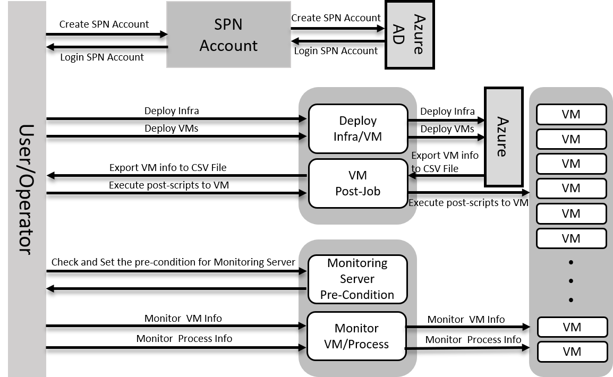

# Azure Monitor in Game Industry

## 1. Overview
게임 산업은 다른 Enterprise 서비스 구축보다 Real-Time 기반으로 돌아가기 때문에(Network Latency 및 service persistence에 민감함) Azure IaaS Service Built-Up 시 모니터링 기능을 구축하는 것이 중요하다. 여기서는 배포된 자원을 모니터링 하기위해 기본적인 PowerShell Script 개발과 해당 모니터링 시스템을 구축하는데 의의를 둔다.

### 1.1 제약사항
AWS 자체 모니터링에서는 모니터링 주기를 최소 1초 간격으로 설정 가능. 사용자가 Custom Metric 기능을 사용하여 모니터링하고자 하는 기능을 추가할수 있음. 
현재 Azure 에서는 해당 기능 미지원.

### 1.2 요구사항
Real-Time 기반의 게임 산업에서는 초단위 시스템 모니터링이 필요함. 

## 2. Environment 
### 2.1 Development Environment Set-Up
* [개발환경구축](../script/powershell/README.md)

### 2.2 Monitoring Environment Set-Up
* [모니터링환경구축](../tools/README.md)

## 3. Azure Function PowerShell Guide
### 3.1 Funtion
기능 | 가이드
------|--------------------------
SPN(Service Principal Name) Account |[Link](../script/powershell/docs/1_spn.md)
Deploy Infra/VM |[Link](../script/powershell/docs/2_deploy_infra_vm.md)
VM Post-Job |[Link](../script/powershell/docs/3_vm_post_jobs.md)
Monitoring Pre-Condition |[Link](../script/powershell/docs/4_set_monitoring_server.md)
Monitor VM/Process |[Link](../script/powershell/docs/5_monitor_vm_process.md)
### 3.2 Main Sequence Diagram

