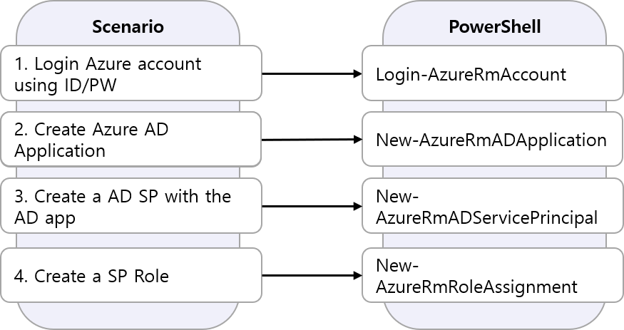

# Azure AD SP Account - PowerShell Example

* 생성 Code: [Link](https://github.com/krazuregame/development/blob/master/script/powershell/src/1_1_Create_SPN.ps1)
* 로그인 Code: [Link](https://github.com/krazuregame/development/blob/master/script/powershell/src/1_2_SPN_Login.ps1)

# 서비스 주체(Service Principal)란?

Azure PowerShell을 사용하여 리소스를 관리하려는 경우 AAD(Azure Active Directory) 서비스 주체에서 실행해야 합니다.


Azure 서비스 주체는 특정 Azure 리소스에 액세스하기 위해 사용자가 만든 앱, 서비스 및 자동화 도구에서 사용하는 보안 ID입니다. 
특정한 역할이 있는 '사용자 ID'(사용자 이름과 암호 또는 인증서)이며 엄격하게 제어됩니다.


일반 사용자 ID와 달리 서비스 주체는 특정 작업만 수행하면 됩니다. 해당 관리 작업을 수행하는 데 필요한 최소 사용 권한 수준을 부여하는 경우 보안이 향상됩니다.


## 예제 설명
다음을 순차적으로 실행한다.

1. 본인의 Azure account 계정에  ID/PW 를 사용하여 로그인하다.
2. Azure AD Application을 생성한다. 
3. AD Application에 Service Principal을 생성한다.
4. AD Service Principal 에 Contributor Role을 생성한다. 


* AD Application 생성
```powershell
New-AzureRmADApplication -DisplayName $spn -HomePage $homepage -IdentifierUris $identifierUri -Password $securepassword 
```

* AD Application의 서비스 주체 생성
```powershell
New-AzureRmADServicePrincipal -ApplicationId $appid
```

* 서비스 주체 권한 부여
```powershell
New-AzureRmRoleAssignment -RoleDefinitionName $spnRole -ServicePrincipalName $appId
```

* 서비스 주체를 사용하여 로그인
```powershell
Add-AzureRmAccount -Credential $cred -TenantId $TenantId -ServicePrincipal
```

## SP Scenario Diagram



