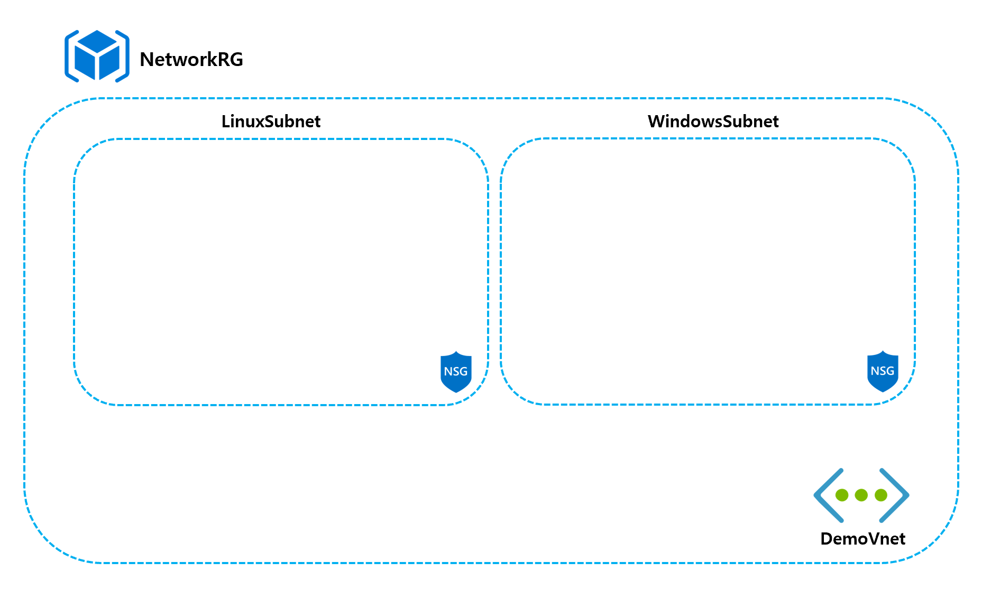

# Deploy Azure Infrastructure using CSV - PowerShell Example

* 실습 Code: [Link](https://github.com/krazuregame/development/blob/master/script/powershell/src/2_1_Bulk_Infrastructure_Creation_CSV.ps1)
      
* CSV 파일 예제 : [Link](https://github.com/krazuregame/development/blob/master/script/powershell/src/Infraconfig.csv)

## Microsoft 참고 문서


* 리소스 그룹 [Docs Link](https://docs.microsoft.com/ko-kr/azure/azure-resource-manager/powershell-azure-resource-manager#understand-scope)


* 가상 네트워크 [Docs Link](https://docs.microsoft.com/ko-kr/azure/virtual-network/quick-create-powershell#create-a-virtual-network)


* 네트워크 보안 그룹 [Docs Link](https://docs.microsoft.com/ko-kr/azure/virtual-network/tutorial-filter-network-traffic-powershell#create-a-network-security-group)


## 예제 설명
CSV 파일의 정보를 읽어들여, 해당 값들에 맞추어 가상머신이 생설될 Infrastructure를 선구성한다.
CSV 파일의 예제를 통해 생성되는 Azure의 리소스들은 다음과 같다.

1. 리소스그룹(Resource Group)
2. 가상네트워크(Virtual Network)
3. 서브넷(Subnet)
4. 네트워크 보안 그룹(Network Security Group)

ResourceGroup | Location | Subnetname | SubnetAddress | vnetname | vnetAddress | nsgname | nsgrulename | port | priority
------------ | ------------- | ------------- | ------------- | ------------- | ------------- | ------------- | ------------- | ------------- | ------------- 
NetworkRG	| Korea Central	| LinuxSubnet	| 10.50.1.0/24	| DemoVnet	| 10.50.0.0/16	| LinuxSSH	| LinuxNSG	| 22	| 1010
NetworkRG	| Korea Central	| WindowsSubnet	| 10.50.2.0/24	| DemoVnet	| 10.50.0.0/16	| WindowsRDP	| WindowsNSG	| 3389	| 1030


## Scenario Diagram


## Powershell 문법
* Foreach를 통한 Array 반복 [Docs Link](https://docs.microsoft.com/en-us/powershell/module/microsoft.powershell.core/about/about_arrays?view=powershell-6#iterations-over-array-elements)
```powershell
$a = 0..9
foreach ($element in $a) {
  $element
}
```
```powershell
<Output>
0
1
2
3
4
5
6
7
8
9
```

## Powershell 코드

* CSV 파일 Import하기 [Docs Link](https://docs.microsoft.com/ko-kr/powershell/module/Microsoft.PowerShell.Utility/Import-Csv?view=powershell-6)

```powershell
Import-csv "c:\InfraConfig.csv"
```


* Foreach를 활용한 looping 작업 [Docs Link](https://docs.microsoft.com/ko-kr/powershell/module/Microsoft.PowerShell.Core/ForEach-Object?view=powershell-6)

```powershell
$csvpath = Import-csv "c:\InfraConfig.csv"
Foreach ($csv in $csvpath){

         $csv.resourcegroup
         $csv.location
             ...
}
```


* Azure 리소스 그룹 생성 [Docs Link](https://docs.microsoft.com/ko-kr/azure/virtual-network/quick-create-powershell#create-a-virtual-network)


```powershell
$csvpath = Import-csv "c:\InfraConfig.csv"
Foreach ($csv in $csvpath){

         New-AzureRmResourceGroup -Name $csv.name -Location $csv.location
}
```


* Azure 가상네트워크 생성 [Docs Link](https://docs.microsoft.com/ko-kr/azure/virtual-network/quick-create-powershell#create-a-virtual-network)


```powershell
$csvpath = Import-csv "c:\InfraConfig.csv"
Foreach ($csv in $csvpath){

         New-AzureRmVirtualNetwork -ResourceGroupName $csv.resourcegroup -Location $csv.location `
         -Name $csv.vnetName -AddressPrefix $csv.vnetAddress
}
```


* Azure 서브넷 생성 [Docs Link](https://docs.microsoft.com/ko-kr/azure/virtual-network/quick-create-powershell#create-a-virtual-network)

```powershell
$csvpath = Import-csv "c:\InfraConfig.csv"
Foreach ($csv in $csvpath){
         
         $vnet = Get-AzureRmVirtualNetwork -ResourceGroupName $csv.resourcegroup -Name $csv.vnetName 
         Add-AzureRmVirtualNetworkSubnetConfig -Name $csv.subnetName -AddressPrefix $csv.subnetAddress -VirtualNetwork $vnet
         $vnet | Set-AzureRmVirtualNetwork
}
```


* Azure 네트워크보안그룹 생성 [Docs Link](https://docs.microsoft.com/ko-kr/azure/virtual-network/tutorial-filter-network-traffic-powershell)

```powershell
$csvpath = Import-csv "c:\InfraConfig.csv"
Foreach ($csv in $csvpath){

    New-AzureRmNetworkSecurityGroup -name $csv.nsgName -ResourceGroupName $csv.resourcegroup -Location $csv.location 
    ...
    Add-AzureRmNetworkSecurityRuleConfig -Name $csv.nsgRuleName -Access Allow -Protocol Tcp -Direction Inbound -Priority $csv.priority -SourceAddressPrefix * -SourcePortRange * -DestinationAddressPrefix * -DestinationPortRange $csv.port
    ... 
    Set-AzureRmNetworkSecurityGroup
    
}
```


## 추가 실습 (별도 리소스 생성)


아래 정보에 맞추어, 추가로 리소스를 생성해 본다. 

추후 생성 할 가상머신의 리소스그룹과, 모니터링 용 실습에 사용되는 Infrastructure 이다.


ResourceGroup | Location | Subnetname | SubnetAddress | vnetname | vnetAddress | nsgname | nsgrulename | port | priority
------------ | ------------- | ------------- | ------------- | ------------- | ------------- | ------------- | ------------- | ------------- | ------------- 
NetworkRG	| Korea Central	| MonitoringSubnet	| 10.50.3.0/24	| DemoVnet	| 10.50.0.0/16	| MonPort	| MonNSG	| 3389	| 1020
LinuxRG | Korea Central	| 	| 	| 	| 	| 	| 	| 	| 
WindowsRG | Korea Central	| 	| 	| 	| 	| 	| 	| 	| 
