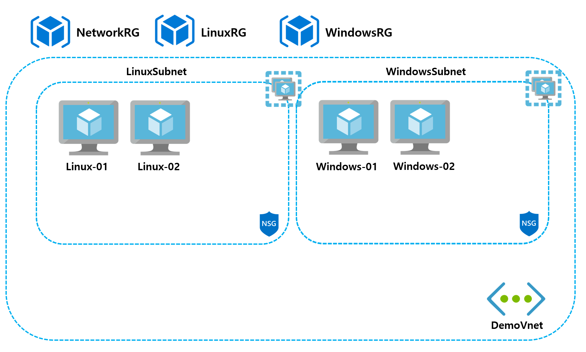

# Deploy Azure VMs using CSV - PowerShell Example

* Code: [Link](https://github.com/krazuregame/development/blob/master/script/powershell/src/2_2_Bulk_VirtualMachines_Creation_CSV.ps1)
* CSV 파일 예제 : [Link](https://github.com/krazuregame/development/blob/master/script/powershell/src/vmconfig.csv)

## Microsoft 참고 문서


* 가상머신 생성 [Docs Link](https://docs.microsoft.com/ko-kr/azure/virtual-machines/scripts/virtual-machines-windows-powershell-sample-create-vm?toc=%2fpowershell%2fmodule%2ftoc.json#sample-script)


## 예제 설명
CSV 파일의 정보를 읽어들여, 해당 값들에 맞추어 생성한 Infrastructure 위에 가상머신을 생성한다.
CSV 파일의 예제를 통해 생성되는 Azure의 리소스들은 다음과 같다.

1. 리소스그룹(Resource Group)
2. 공용 IP(Public IP)
3. 네트워크인터페이스카드(NIC)
4. 디스크(OS Disk)
5. 가용성집합(Availability Set)
6. 가상머신(Virtual Machine)


vmname | resourcegroup | location | vmsize | nwresourceGroup | vnetName | subnetName | pipName | nicname | nsgname | osdiskname | disksize | os | publisher | offer | sku | AvailabilitySetName
------------ | ------------- | ------------- | ------------- | ------------- | ------------- | ------------- | ------------- | ------------- | ------------- | ------------- | ------------- | ------------- | ------------- | ------------- | ------------- | -------------
Linux-01 | LinuxRG | Korea Central | Standard_DS2_v2 | NetworkRG | DemoVnet | LinuxSubnet | Linux-01-pip | Linux-01-nic | LinuxNSG | Linux-01-disk | 127 | linux | OpenLogic | CentOS | 7.3 | LinuxAVS
Linux-02 | LinuxRG | Korea Central | Standard_DS2_v2 | NetworkRG | DemoVnet | LinuxSubnet | Linux-02-pip | Linux-02-nic | LinuxNSG | Linux-02-disk | 127 | linux | OpenLogic | CentOS | 7.3 | LinuxAVS
Windows-01 | WindowsRG | Korea Central | Standard_DS2_v2 | NetworkRG | DemoVnet | WindowsSubnet | Windows-01-pip | Windows-01-nic | WindowsNSG | Windows-01-disk | 127 | windows | MicrosoftWindowsServer | WindowsServer | 2016-Datacenter | WindowsAVS
Windows-02 | WindowsRG | Korea Central | Standard_DS2_v2 | NetworkRG | DemoVnet | WindowsSubnet | Windows-02-pip | Windows-02-nic | WindowsNSG | Windows-02-disk | 127 | windows | MicrosoftWindowsServer | WindowsServer | 2016-Datacenter | WindowsAVS


## Scenario Diagram
 


## Powershell 문법

* Start-Job을 통한 Background Job 실행 [Docs Link](https://docs.microsoft.com/en-us/powershell/module/microsoft.powershell.core/start-job?view=powershell-6)

```powershell
Start-Job -ScriptBlock {Get-Process}
Id    Name  State    HasMoreData  Location   Command
---   ----  -----    -----------  --------   -------
1     Job1  Running  True         localhost  get-process
```

* Receive-Job을 통한 Background Job 결과 출력 [Docs Link](https://docs.microsoft.com/en-us/powershell/module/microsoft.powershell.core/receive-job?view=powershell-6)
```powershell
$job = Start-Job -ScriptBlock {Get-Process}
$job | Receive-Job
```

* Foreach / Start-Job을 통한 병렬 Background 병렬 Job 실행 [Docs Link](https://docs.microsoft.com/en-us/powershell/module/microsoft.powershell.core/about/about_arrays?view=powershell-6#iterations-over-array-elements)
```powershell
$server = 'Windows-01', 'Windows-02', 'Windows-03', ...
Foreach ($server in $servers){ 
         Start-Job -Name $server -ScriptBlock {Get-Process}
}
```

## Azure Powershell 코드 
* 가용성 집합(Availability Set) 생성 [Docs Link](https://docs.microsoft.com/ko-kr/powershell/module/azurerm.compute/new-azurermavailabilityset?view=azurermps-6.10.0)
```powershell
New-AzureRmAvailabilitySet -Location $location -Name $AvailabilitySetName -ResourceGroupName $resourceGroup `
-Sku aligned -PlatformFaultDomainCount 2 -PlatformUpdateDomainCount 5
```
> 가용성 집합 참고 문서 [Docs Link](https://blogs.technet.microsoft.com/koalra/2014/08/06/microsoft-azure-vm-availability-set-load-bala/)


