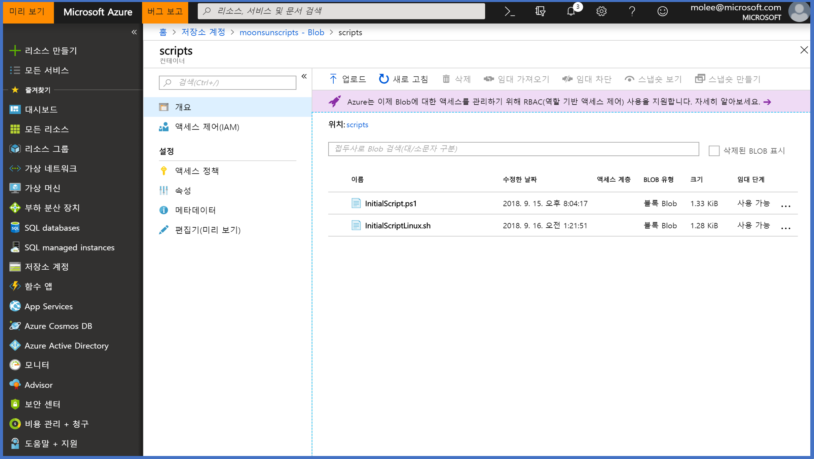
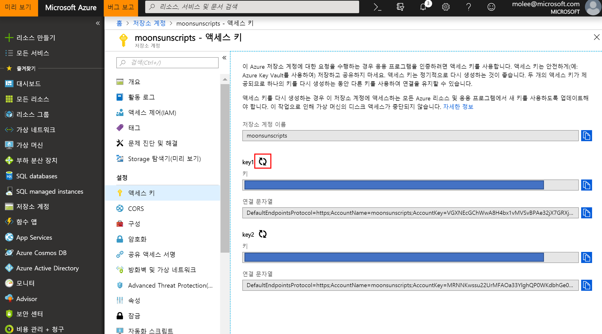

# Excute Post Script to Azure VMs

* Powershell Code: [Link](https://github.com/krazuregame/development/blob/master/script/powershell/src/3_2_Excute_Post_Script.ps1)
* Post Script 예제 : [Linux용 Script](https://github.com/krazuregame/development/blob/master/script/powershell/src/InitialScriptLinux.sh), [Windows용 Script](https://github.com/krazuregame/development/blob/master/script/powershell/src/InitialScriptWindows.ps1)

## Microsoft 참고 문서
* Azure Extension 참고 문서:  [Linux Extension Link](https://docs.microsoft.com/ko-kr/azure/virtual-machines/extensions/custom-script-linux), [Windows Extension Link](https://docs.microsoft.com/ko-kr/azure/virtual-machines/extensions/custom-script-windows)


Type | Windows | Linux
------------ | ------------- | -------------
publisher | Microsoft.Compute | Microsoft.Compute.Extensions
형식 | CustomScriptExtension | CustomScript
typeHandlerVersion | 1.9 | 2.0

## 예제 설명
Windows와 Linux에 실행될 스크립트를 작성한 뒤, Azure Blob Storage에 업로드하여 각 가상머신에 운영체제에 맞게 스크립트를 실행한다.


Custom Script Extension은 가상머신에서 스크립트를 다운로드하고 실행한다. 
이 Extension은 가상머신 배포 후, 소프트웨어 설치 또는 기타 구성/관리 작업에 유용하며, 스크립트를 Azure Storage 또는 기타 액세스가 가능한 인터넷 위치에서 다운로드하여 실행할 수 있다.


1. 운영체제 / 버전에 따라 적용할 스크립트 작성
2. Azure Blob에 스크립트 파일 업로드
3. SAS(Shared Access Signature)키 생성
4. SAS키를 통한 Blob 스크립트 파일 접근
5. Azure Custom Script Extension을 통해 각 가상머신에 스크립트 적용


## Scenario Diagram
 


## Azure Blob Storage에 스크립트 파일 업로드 / SAS 키 생성
1. Azure 포탈에서 저장소 계정으로 이동하여, "저장소계정 - Blob 저장소 - 컨테이너"에 스크립트 파일을 업로드 한다. (없으면 생성) 


 


2. 저장소 계정에서 "엑세스 키" 메뉴를 선택하여, SAS Key를 생성하고 복사한다.

 

> "저장소 계정" / "엑세스 키" / "스크립트 파일 URL" 를 기록하여 둔다. 이 후, Powershell 스크립트에 적용한다.
>> "$storageAccountName / $storageAccountKey / $scripturi" 변수에 각각 적용


* Start-Job을 통한 Background Job 실행 [Docs Link](https://docs.microsoft.com/en-us/powershell/module/microsoft.powershell.core/start-job?view=powershell-6)

```powershell
Start-Job -ScriptBlock {Get-Process}
Id    Name  State    HasMoreData  Location   Command
---   ----  -----    -----------  --------   -------
1     Job1  Running  True         localhost  get-process
```

* Receive-Job을 통한 Background Job 결과 출력 [Docs Link](https://docs.microsoft.com/en-us/powershell/module/microsoft.powershell.core/receive-job?view=powershell-6)
```powershell
$job = Start-Job -ScriptBlock {Get-Process}
$job | Receive-Job
```

* Foreach / Start-Job을 통한 병렬 Background 병렬 Job 실행 [Docs Link](https://docs.microsoft.com/en-us/powershell/module/microsoft.powershell.core/about/about_arrays?view=powershell-6#iterations-over-array-elements)
```powershell
$server = 'Windows-01', 'Windows-02', 'Windows-03', ...
Foreach ($server in $servers){ 
         Start-Job -Name $server -ScriptBlock {Get-Process}
}
```

## Azure Powershell 코드 
* 가용성 집합(Availability Set) 생성 [Docs Link](https://docs.microsoft.com/ko-kr/powershell/module/azurerm.compute/new-azurermavailabilityset?view=azurermps-6.10.0)
```powershell
New-AzureRmAvailabilitySet -Location $location -Name $AvailabilitySetName -ResourceGroupName $resourceGroup `
-Sku aligned -PlatformFaultDomainCount 2 -PlatformUpdateDomainCount 5
```
> 가용성 집합 참고 문서 [Docs Link](https://blogs.technet.microsoft.com/koalra/2014/08/06/microsoft-azure-vm-availability-set-load-bala/)


* 네트워크 구성 [Docs Link](https://docs.microsoft.com/ko-kr/powershell/module/azurerm.network/new-azurermnetworkinterface?view=azurermps-6.10.0#create)
```powershell
# 가상머신에 할당할 공용 IP를 생성후, $pip 변수에 공용 IP 정보 저장
$pip = New-AzureRmPublicIpAddress -ResourceGroupName $resourceGroup -Location $location -Name $pipName -AllocationMethod Static
$pip = Get-AzureRmPublicIpAddress -ResourceGroupName $resourceGroup -Name $pipName

# Vnet, Subnet 정보를 $Subnet 변수에 저장 
$Subnet=Get-AzureRmVirtualNetworkSubnetConfig -VirtualNetwork $vnet -name $subnetname

# 가상머신에 추가할 네트워크 인터페이스를 생성 (/with $pip, $subnet, $nsg)
$nic = New-AzureRmNetworkInterface -Name $nicName -ResourceGroupName $resourceGroup -Location $location `
  -SubnetId $Subnet.Id -PublicIpAddressId $pip.Id -NetworkSecurityGroupId $nsg.Id
```

* 가상머신 생성
```powershell
# 가상머신 구성 정보등록
# 가용성 집합 정보등록
$vmConfig = New-AzureRmVMConfig -VMName $vmName -VMSize $vmSize -AvailabilitySetId $GetAVS.Id

# 가상머신 운영체제 이미지 정보등록
$vmConfig = Set-AzureRmVMSourceImage -VM $vmconfig -PublisherName $publisher -Offer $offer -Skus $sku -Version latest
$vmConfig = Set-AzureRmVMOperatingSystem -VM $vmconfig -Windows -ComputerName $vmName -Credential $oscred -ProvisionVMAgent

# 가상머신 OS 디스크 정보등록
$vmConfig = Set-AzureRmVMOSDisk -VM $vmConfig -Name "$osdiskname" -DiskSizeInGB $disksize -CreateOption FromImage -Caching ReadWrite -StorageAccountType Premium_LRS

# 가상머신 네트워크 정보등록
$vmConfig = Add-AzureRmVMNetworkInterface -VM $vmConfig -Id $nic.Id
    
# 가상머신 생성
New-AzureRmVM -ResourceGroupName $resourceGroup -Location $location -VM $vmConfig
```


