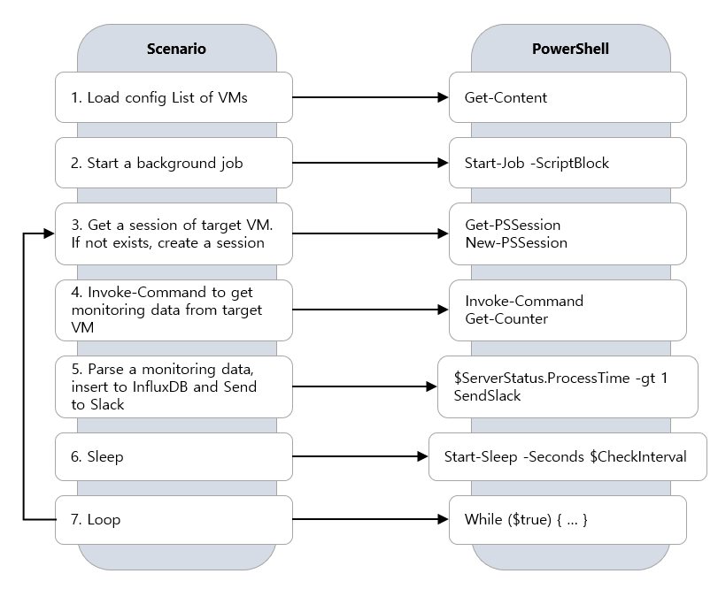

# Azure Monitor VM/Process (Basic) - PowerShell Example

* Code : https://github.com/krazuregame/development/blob/master/script/powershell/src/5_Basic_Remote_Session_Scriptblock.ps1

## 예제 설명
다음을 순차적으로 실행한다.

1. 모니터링 대상의 VM 목록을 Load 한다.
2. 대상 VM 별로 Background Job을 생성한다.
3. 대상 VM사이에 Session이 을 가져온다. (없으면 생성)
4. Invoke-Command로 대상 VM에 모니터링 정보를 수집하기 위한 ScriptBlock을 실행한다.
5. 수집된 모니터링 정보를 적절히 판단하여 InfluxDB, Slack등으로 보낸다.
6. 모니터링 수집 간격만큼 Sleep 후 3번부터 다시 시작한다.

## 추가 사항

1. 대상 VM과의 Session 생성을 위해서는 미러링 계정 또는 Administrator 권한의 Credential 이 필요하다.
2. 이 예제는 Azure Log Metix에서 제공하지 않는 VM내부의 정보를 실시간으로 가져오기 위한 예제이다.
3. InfluxDB에 Insert시에 보안을 위해서 계정 인증 사용을 권장한다.


## Monitor VM/Process Diagram



## Slack Webhook Powershell 실행 예제 (참고)

* Webhook Slack 참고 문서 : [Link](https://api.slack.com/incoming-webhooks)


```powershell

$payload = 
        @{
            "text" = "'$vmName' is successfully created `n Time: $getdate"
        }
 
       $webhook = Invoke-WebRequest -UseBasicParsing `
        -Body (ConvertTo-Json -Compress -InputObject $payload) `
        -Method Post `
        -Uri "https://hooks.slack.com/services/***********************"


```
